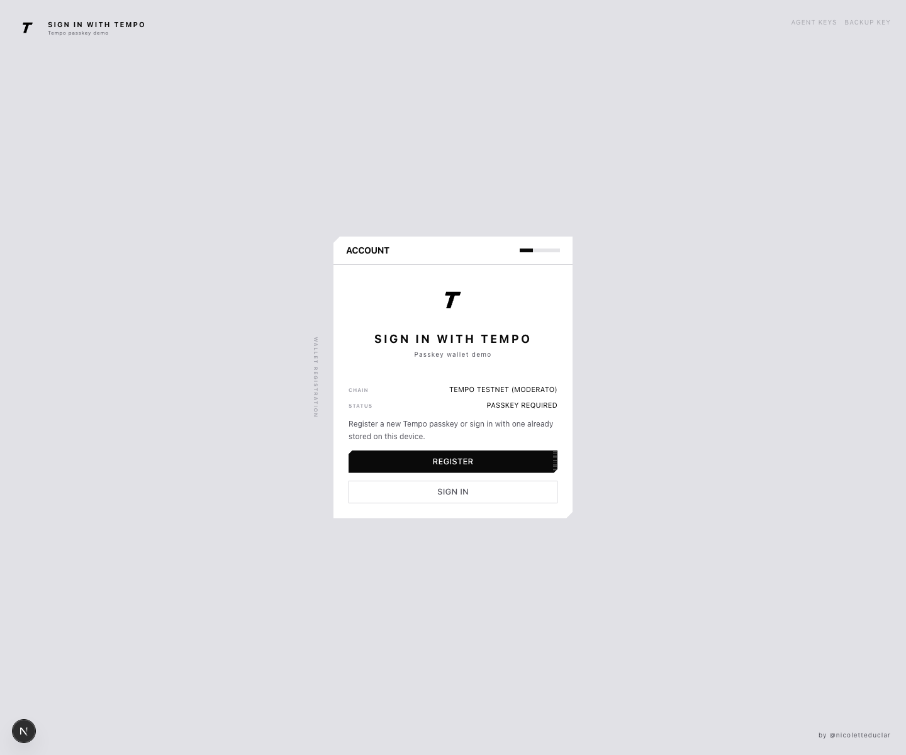

# Sign In With Tempo

A minimal open-source Next.js demo for Tempo passkey wallets.



This app is passkey-only, self-contained, and includes wallet summary, backup,
and agent key screens without any backend or database dependency.

Live preview: https://signin-with-tempo.vercel.app/

## Important

This demo intentionally uses `KeyManager.localStorage()` from `wagmi/tempo`.

That keeps the app self-contained with no backend and no database, but it also
means the credential-to-public-key mapping only exists in this browser storage.
If local storage is cleared, or you sign in from a different browser without a
shared backend key manager, the demo cannot recover that mapping.

## Before Production Use

- Strongly recommend linking passkey registration to an existing user identity
  such as email, phone, or an authenticated account record. Without that,
  repeated registration from different browsers or devices can create duplicate
  passkey-backed users for the same person.
- The backup flow in this demo creates an access key with effectively unlimited
  spend and no expiry. Treat it like a high-privilege recovery secret, not a
  lightweight convenience export.
- In production, the backup key should usually have stronger ceremony around
  creation, storage, and recovery. At minimum, require explicit confirmation and
  make the security implications obvious to the user.
- This demo stores passkey mapping state in browser-local storage. A production
  app should use a durable, user-scoped account-linking layer or key manager so
  users can recover and reuse the same account across devices.
- Agent keys in production should stay tightly scoped with explicit spend
  limits, expiry, auditability, and revocation UX. The demo screen is useful as
  a reference flow, but not as a final production policy.

## Local Run

```bash
npm install
npm run dev
```

Then open `http://localhost:3000`.
